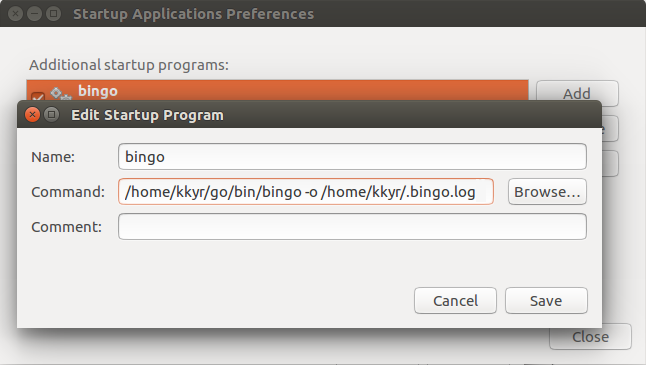

# bingo

Sync your wallpaper with Bing's image of the day, every day.

# Installation

`$ go get github.com/kkyr/bingo`

# Usage

```text
USAGE: bingo [OPTIONS]

OPTIONS:
  -k    update wallpaper once and exit
  -o string
        output file for logs
  -t string
        24-hour time when wallpaper is updated (default "08:00")

```

`bingo` is best run as a daemon, so that it can update your wallpaper in the background every day.

You should preferably register it with your OS as a startup application. If you're using GNOME you can do so in _Startup Applications_:



If you only want to update your wallpaper "on demand" then run it with the `-k` flag:

`$ bingo -k`
